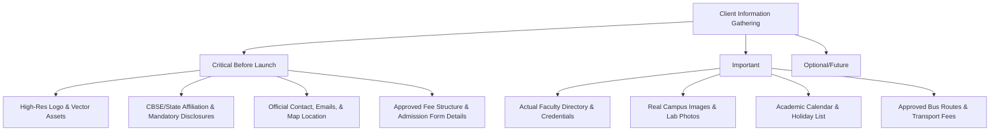
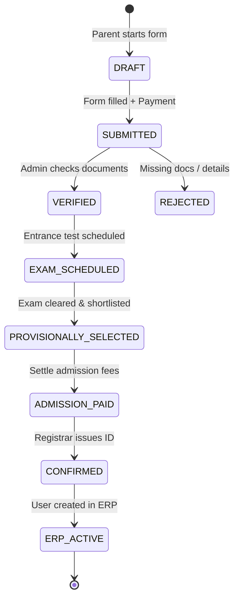
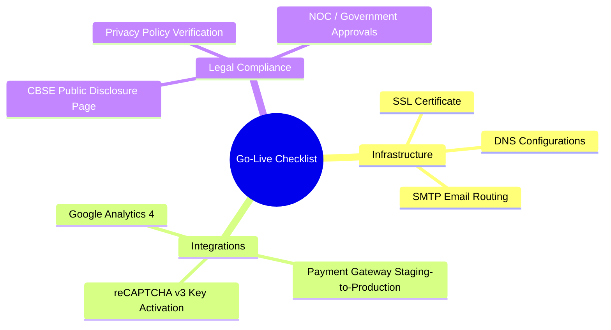

# O'Nest Gurukul — Comprehensive Pre-Delivery Web & ERP Audit Report

This audit report serves as the final evaluation of the **O'Nest Gurukul** school website and ERP preparation. It has been prepared by our agency's senior cross-functional team (Product Management, UX/UI Design, Full Stack Engineering, SEO, Security, and QA) to outline critical improvements and actions needed before project sign-off and deployment.

---

## TABLE OF CONTENTS
- [Phase 1: Content Audit](#phase-1-content-audit)
- [Phase 2: Client Information Checklist](#phase-2-client-information-checklist)
- [Phase 3: Missing Website Features](#phase-3-missing-website-features)
- [Phase 4: Admission Automation System Design](#phase-4-admission-automation-system-design)
- [Phase 5: Admin Panel Requirements](#phase-5-admin-panel-requirements)
- [Phase 6: Database Review & Optimization](#phase-6-database-review--optimization)
- [Phase 7: SEO Review & Auditing](#phase-7-seo-review--auditing)
- [Phase 8: Mobile UX/UI Experience Review](#phase-8-mobile-uxui-experience-review)
- [Phase 9: Security Review & Vulnerability Assessment](#phase-9-security-review--vulnerability-assessment)
- [Phase 10: Performance Review & Optimizations](#phase-10-performance-review--optimizations)
- [Phase 11: Go-Live & Launch Checklist](#phase-11-go-live--launch-checklist)
- [Phase 12: Final Delivery Report & Scorecard](#phase-12-final-delivery-report--scorecard)

---

## PHASE 1: CONTENT AUDIT

We performed a deep-dive content analysis across all 7 pages. The main issues identified involve generic AI-generated copy, unrealistic placeholders, and a lack of local Ratnagiri branding and institutional warmth.

| Page | Section / Element | Current Problem | Why It Is Bad | Suggested Improvement | Client Approval | Can Remain As-Is |
| :--- | :--- | :--- | :--- | :--- | :---: | :---: |
| **All Pages** | Navigation & Footer | Unified navigation is copy-pasted across 7 files; links point to static pages with hardcoded paths. | High maintenance overhead; dynamic changes require manual, error-prone edits in 7 places. | Extract navigation and footer into reusable component templates or server-side includes. | No | No |
| **index.html** | Hero Headline & Body | "Inspiring Young Minds. Building Future Leaders." and "A nurturing environment..." are generic AI boilerplate text. | Fails to show school personality; sounds like a stock education template, lack of local connection. | Rewrite to highlight O'Nest Gurukul’s unique "home-like care combined with modern Gurukul values" in Ratnagiri. | Yes | No |
| **index.html** | Quick Trust Bar | "1000+ Students", "50+ Teachers", "100% Passing Results" are round placeholder figures. | Unrealistic and fake. If incorrect, it destroys parent trust immediately. | Fetch and display real verified statistics from the school administration. | Yes | No |
| **index.html** | Why Choose Us | Uses standard AI items: Academic Excellence, Individual Attention, Technology Enabled. | Standard template copy that applies to every school; lacks unique institutional traits. | Restructure to feature specific Gurukul initiatives, local community actions, or special programs. | Yes | No |
| **index.html** | Faculty Showcase | Contains placeholders (e.g. Mrs. Anjali Sawant, Mr. Rajesh Kulkarni) with generic quotes. | False credentials. Can lead to legal issues and ruins credibility if parents don't see these teachers. | Replace with actual faculty profiles, real photos, certified credentials, and authentic quotes. | Yes | No |
| **index.html** | Testimonials | Testimonial text ("I am extremely happy...") is robotic, using common Maharashtrian names. | Sounds artificial and lacks emotion. Lacks details of child's real achievements. | Collect genuine reviews from real parents, featuring actual parent-child photos and class details. | Yes | No |
| **about.html** | Vision & Mission | Standard mission statements about "holistic, globally-competitive citizens". | Lacks the specific "Gurukul + Home" ethos of the O'Nest brand. | Redraft to emphasize the school's synthesis of Gurukul learning traditions and modern technology. | Yes | No |
| **about.html** | Founder's Message | Generic, robotic letter from the Founder. | Fails to project authentic leadership, character, and emotional resonance. | Rewrite based on a short interview with the actual founder/principal, adding their signature. | Yes | No |
| **admissions.html** | Quick Enquiry Note | States "Orientation sessions are scheduled on Saturdays at 11:00 AM" and "takes 45–60 min". | May not align with the school's actual operations. Causes friction if parents turn up unscheduled. | Verify exact scheduling slots, durations, and details with the school admissions office. | Yes | No |
| **admissions.html** | Eligibility & Age | Generic age requirements for Class 1 to 10. | Might violate state board guidelines or recent national education policies (NEP minimum age rules). | Align age limits with local education board (CBSE/State Board) and government directives. | Yes | No |
| **campus-facilities.html** | Lab Descriptions | Descriptions of science and computer labs are highly repetitive and list standard kit items. | Sounds like an inventory catalog rather than an engaging learning experience. | Rewrite copy to focus on how students interact in labs (e.g., student-led robotics, coding clubs). | Yes | No |
| **preprimary.html** | "Polaroid" Highlights | Playful descriptions of nursery activities. | Mostly well-styled, but references to specific tools/toys are generic. | Confirm specific classroom toys, Montessori tools, and playground gear used at the school. | Yes | Yes |
| **students-life.html** | Student Clubs | Generic clubs (Ecology club, Coding club, Literature club) with stock images. | Represents active clubs that might not exist in the school, setting false expectations. | Confirm actual active student clubs, house divisions, and sports teams; rewrite copy to match. | Yes | No |

---

## PHASE 2: CLIENT INFORMATION CHECKLIST

Below is the definitive list of assets, text copy, and documents that must be collected from the school before the website can be deployed to production.



### 1. Critical Before Launch (Hard Launch Blockers)
*   [ ] **High-Resolution Logo**: Vector files (`.svg`, `.eps`) and high-resolution PNGs with transparent backgrounds.
*   [ ] **CBSE / State Board Affiliation Certificate**: Official copy showing Affiliation Number, School Code, and validity.
*   [ ] **Mandatory Public Disclosure Document**: Regulated document containing school details, infrastructure safety certificates, and committee formations (legally required for CBSE schools).
*   [ ] **Official Contact Information**: Registered phone numbers, primary administration email (`info@onestgurukul.in`), and administrative operating hours.
*   [ ] **Verified Google Map Location**: Ownership coordinates and pin setup for the exact school gate.
*   [ ] **Approved Fee Structure (AY 2026-27)**: Grade-wise tuition fees, admission fee, term fee, security deposits, and payment schedule.
*   [ ] **Official Principal / Founder Message**: Signed messages and high-resolution professional headshots.
*   [ ] **Legal & Privacy Policies**: Terms of Service, Privacy Policy, Cookie Policy, and Refund/Cancellation Policy for fees.

### 2. Important (Needed for Credibility)
*   [ ] **Complete Faculty Directory**: Names, designations, qualifications, teaching experience, and headshots of all teaching staff.
*   [ ] **Real Campus Media**: Professional photography of classrooms, science labs, computer labs, library, playground, and cafeteria (replacing stock/AI graphics).
*   [ ] **Academic Calendar & Holiday List**: PDF and sheet schedules of all school terms, holidays, and exam cycles.
*   [ ] **Transport Details**: Bus routes, stops, bus driver details, safety certificates, and grade-wise transport fee structure.
*   [ ] **Uniform & Book List**: Prescribed uniform designs/vendors and textbook list (ISBN details) for each grade.
*   [ ] **Real Testimonials**: 5–10 quotes from real parents and students, including name, photo, and student class.

### 3. Optional (Enhances Engagement)
*   [ ] **Admissions Brochure / Prospectus**: Downloadable high-quality PDF.
*   [ ] **School Anthem**: Text copy and an audio file (if available).
*   [ ] **Social Media Links**: Access links to official Facebook, Instagram, LinkedIn, and YouTube handles.
*   [ ] **Awards & Achievements**: High-resolution scans of certificates, trophies, and newspaper clippings.

### 4. Future Enhancement (ERP Integration phase)
*   [ ] **Student Handbook / School Rules**: Complete policy guidelines document.
*   [ ] **Alumni Database**: Preliminary contact details of passed-out batches.
*   [ ] **Newsletter Archive**: Past volumes of school newsletters.

---

## PHASE 3: MISSING WEBSITE FEATURES

Evaluating O'Nest Gurukul against premium school website benchmarks reveals several gaps. The following table identifies these missing features, prioritized by urgency.

| Feature | Description | Business / UX Impact | Priority |
| :--- | :--- | :--- | :--- |
| **Sticky CTA / Floating Apply Button** | A persistent "Apply Now" button on mobile/desktop that stays in view during scroll. | Increases conversion rate (CTR) by making action accessible at any scroll depth. | **Must Have** |
| **Official ERP Portal Integration** | Direct, secure portal links for Students, Parents, and Teachers. | Fundamental for school operations; acts as the primary hub for parents. | **Must Have** |
| **Mandatory Document Download Hub** | Dedicated resource section for CBSE Disclosures, NOC, and RTE forms. | Essential for legal compliance and trust verification. | **Must Have** |
| **WhatsApp Chat Support** | A direct WhatsApp widget for quick enquiries, targeting mobile parents. | Reduces friction, allowing parents to instantly start conversations with admissions. | **Should Have** |
| **Dynamic Notice Board / Circulars** | A backend-controlled system to publish daily alerts, homework, and circulars. | Reduces administrative load of sending group emails or messages manually. | **Should Have** |
| **FAQ Section** | Interactive accordion answering questions on admissions, fees, transport, and curriculum. | Reduces support queries by handling common parental concerns instantly. | **Should Have** |
| **Active Search Capability** | Site-wide search to find circulars, admission details, or specific pages. | Enhances UX, allowing users to find specific resources without digging into menus. | **Should Have** |
| **Interactive Event Calendar** | A calendar showing exams, holidays, parent-teacher meetings, and sports day. | Helps parents plan ahead; integrates with Google Calendar. | **Good to Have** |
| **Virtual 360° Campus Tour** | Embedded virtual walkthrough of school infrastructure. | Extremely high engagement value for parents who cannot visit immediately. | **Good to Have** |
| **Careers Page / Resume Upload** | Simple form for teachers to apply for open vacancies and upload CVs. | Builds a continuous pipeline of teaching talent for the HR department. | **Good to Have** |
| **Interactive Fee Calculator** | Form that calculates fees based on grade, transport routes, and sibling discounts. | Provides financial transparency, reducing phone inquiries about cost breakdowns. | **Future** |
| **Alumni Network Hub** | Portal for alumni registration, sharing success stories, and mentoring. | Fosters long-term institutional network value. | **Future** |

---

## PHASE 4: ADMISSION AUTOMATION SYSTEM DESIGN

To replace the insecure Google Sheets integration, we propose a secure, production-grade automated admission workflow.

### 1. Workflow Architecture & Status Changes



### 2. Database Models & Schema Design (Relational Model)

#### User Model (`users`)
*   `id`: UUID (Primary Key)
*   `email`: VARCHAR (Unique, Indexed)
*   `password_hash`: VARCHAR
*   `phone`: VARCHAR (Unique, Indexed)
*   `role`: ENUM ('parent', 'student', 'admin', 'registrar', 'accountant')
*   `is_verified`: BOOLEAN
*   `created_at`: TIMESTAMP

#### Application Model (`applications`)
*   `id`: UUID (Primary Key)
*   `application_number`: VARCHAR (Unique, format: `ONG-2026-XXXX`)
*   `user_id`: UUID (Foreign Key -> `users.id`)
*   `student_first_name`: VARCHAR
*   `student_last_name`: VARCHAR
*   `date_of_birth`: DATE
*   `gender`: ENUM ('male', 'female', 'other')
*   `grade_applied`: VARCHAR
*   `status`: ENUM ('draft', 'submitted', 'verified', 'rejected', 'exam_scheduled', 'provisionally_selected', 'admission_paid', 'confirmed')
*   `data`: JSONB (Stores custom form fields: medical history, sibling details, transport choices)
*   `created_at`: TIMESTAMP
*   `updated_at`: TIMESTAMP

#### Document Model (`documents`)
*   `id`: UUID (Primary Key)
*   `application_id`: UUID (Foreign Key -> `applications.id`)
*   `document_type`: ENUM ('birth_certificate', 'previous_marksheet', 'transfer_certificate', 'aadhaar_card', 'parent_aadhaar')
*   `file_url`: VARCHAR (S3 secure pre-signed URL)
*   `is_verified`: BOOLEAN
*   `rejection_reason`: VARCHAR
*   `uploaded_at`: TIMESTAMP

#### Payment Model (`payments`)
*   `id`: UUID (Primary Key)
*   `application_id`: UUID (Foreign Key -> `applications.id`)
*   `transaction_id`: VARCHAR (Unique, Razorpay/Stripe reference)
*   `amount`: DECIMAL(10,2)
*   `currency`: VARCHAR(3) (Default: 'INR')
*   `status`: ENUM ('pending', 'completed', 'failed', 'refunded')
*   `payment_type`: ENUM ('application_fee', 'admission_fee')
*   `created_at`: TIMESTAMP

---

### 3. Backend Logic & Status Management

#### A. Session Auto-Save Draft
*   **Trigger**: User typing in form.
*   **Logic**: Throttle API requests (every 5 seconds) to submit the current state of form fields to `/api/v1/admissions/draft` storing the payload in the `applications.data` JSONB column. This ensures no progress is lost on page refreshes or drop-offs.

#### B. Document Upload Validation
*   **Validation Rules**: Max file size: 5MB. Formats: PDF, PNG, JPEG.
*   **Security Protocol**: Files are uploaded from the client directly to a secure Amazon S3 bucket via pre-signed URLs. Files are scanned for malware using an S3 virus scan lambda function before marking `is_uploaded` as true.

#### C. Payment Integration & Security
*   **Gateway**: Razorpay / Stripe.
*   **Flow**:
    1. Parent clicks "Submit and Pay".
    2. Backend creates a pending transaction order on the Payment Gateway API, returning the Order ID.
    3. Frontend opens the secure checkout widget.
    4. Upon completion, the gateway sends a secure Webhook event (`payment.captured`) to the backend.
    5. The backend validates the payment signature using the gateway secret key, marks the payment as `completed`, locks the application, updates its status to `SUBMITTED`, and sends confirmations.

---

### 4. Communication & Notification Engine

| Trigger Event | Status From -> To | Recipient | Channel | Template Content |
| :--- | :--- | :--- | :--- | :--- |
| Account Registration | `N/A` | Parent | Email & SMS | OTP for Account Activation: `{{otp}}` (valid for 10 minutes). |
| Application Submitted | `DRAFT` -> `SUBMITTED` | Parent | Email | "Thank you for applying. Your application number is `{{app_no}}`. You can track your status on the portal." |
| Admission Rejected | `SUBMITTED` -> `REJECTED` | Parent | Email | "Your application needs attention. Reason: `{{reason}}`. Kindly re-upload or update details by `{{date}}`." |
| Test Scheduled | `VERIFIED` -> `EXAM_SCHED` | Parent | Email & SMS | "Entrance exam for `{{student_name}}` is scheduled on `{{date}}` at `{{time}}`. Venue: School Campus." |
| Fee Payment Request | `EXAM_SCHED` -> `PROV_SEL` | Parent | Email & SMS | "Congratulations! `{{student_name}}` has been provisionally selected. Please pay the admission fees via this link: `{{payment_link}}`." |
| Welcome Package | `ADMISSION_PAID` -> `CONFIRMED` | Parent & Student | Email | "Welcome to O'Nest Gurukul! Your Student ID is `{{student_id}}`. Login details for Parent Portal inside." |

---

## PHASE 5: ADMIN PANEL REQUIREMENTS

The Admin Panel serves as the operations dashboard for the school. It must be built with role-based access control (RBAC), secure authentication, and a clear audit trail.

### 1. Module Matrix & User Permissions

| Module | Features | SuperAdmin | Registrar | Accountant | Teacher |
| :--- | :--- | :---: | :---: | :---: | :---: |
| **Admission Dashboard** | Review applications, document verification, interview scheduling, admit card generation. | **CRUD** | **CRUD** | No Access | No Access |
| **Student Directory** | Class-wise profiles, attendance logs, exam grades, emergency contacts, documents. | **CRUD** | **RU** | **R** | **RU** (My Class) |
| **Fee Manager** | Set fee heads, record payments, trigger outstanding notifications, print receipts, process refunds. | **CRUD** | No Access | **CRUD** | No Access |
| **CMS Controller** | Edit text on main website pages, upload images to gallery, update sliders and marquee text. | **CRUD** | **RU** | No Access | No Access |
| **Notice Board / News** | Post circulars, school events, PDF announcements, blogs. | **CRUD** | **CRUD** | No Access | **CR** |
| **Reports & Analytics** | Revenue statements, admission pipeline counts, teacher attendance logs, performance metrics. | **CRUD** | **R** | **R** | No Access |
| **System Settings** | Manage user roles, database backup scheduler, SMTP setup, API keys, system logs. | **CRUD** | No Access | No Access | No Access |

*Key: **C** = Create, **R** = Read, **U** = Update, **D** = Delete*

### 2. Logs, Auditing, and Safety Controls
*   **Security & Audit Trail**: Every write/delete operation in the Admin Panel must create an immutable entry in the `audit_logs` table tracking: `timestamp`, `user_id`, `ip_address`, `action`, and `diff_payload` (before and after state).
*   **Database Backup System**: Automated daily backups of the database schema and data, stored encrypted in an off-site, cold-storage S3 bucket. SuperAdmins must have the ability to run manual backups and trigger restore protocols under maintenance lockouts.

---

## PHASE 6: DATABASE REVIEW & OPTIMIZATION

The current site is purely static HTML and lacks a database. To build the future ERP platform and dynamic website, the database must be designed correctly from day one.

### 1. Missing Database Tables (Core ERP Entities)
To support a full-scale School ERP, the database must include the following entities:
*   `classes` / `sections`: Tracks academic classes (Class 1, 2, etc.) and sections (A, B, C).
*   `attendance`: Daily registration logs tracking student status (`present`, `absent`, `late`, `excused`).
*   `grades` / `marks`: Exam schedules, test scores, grading metrics, and final report cards.
*   `fee_installments`: Tracks specific fee deadlines, partial payments, and late fine counters.
*   `transport_routes` / `bus_allocations`: Links students to specific buses, routes, and drivers.
*   `announcements` / `circulars`: Class-specific and school-wide communications with PDF attachments.

### 2. Indexes & Performance Optimization Plan
*   **Email Indexing**: Create B-Tree unique indexes on `users(email)` for fast login resolution times.
*   **Application Pipeline Index**: Compound index on `applications(status, grade_applied)` to ensure the admin dashboard dashboard counts load under 100ms.
*   **Student Search Index**: Multi-column index on `students(first_name, last_name, roll_no, class_id)` to handle rapid search lookups in the student directory.
*   **Foreign Key Constraints**: All foreign keys must have cascading options set (`ON DELETE RESTRICT`) to protect academic and financial history records.

---

## PHASE 7: SEO REVIEW & AUDITING

The current static website has basic SEO metadata, but needs optimization to rank for local keywords (e.g., "best school in Ratnagiri") and show rich search snippets.

### 1. Metadata & Keyword Optimization

| Page | Current Title | Recommended Title | Target Keywords |
| :--- | :--- | :--- | :--- |
| **Home** | O'Nest Gurukul - Where Learning Feels Like Home | O'Nest Gurukul | Best CBSE School in Ratnagiri | CBSE School Ratnagiri, best school in Ratnagiri, Gurukul school Ratnagiri |
| **About** | About Us | About O'Nest Gurukul | School Founders, Ratnagiri Campus | School founders Ratnagiri, school vision & mission |
| **Admissions** | Admissions | School Admissions 2026-27 | O'Nest Gurukul Ratnagiri | School admissions Ratnagiri, school fees structure |
| **Campus** | Campus & Facilities | World-Class School Infrastructure | O'Nest Gurukul | Smart classrooms, science labs Ratnagiri, sports school |
| **Contact** | Contact Us | Contact O'Nest Gurukul | Wadekar Wadi Ratnagiri | School phone number, map coordinates O'Nest Gurukul |
| **Pre-Primary** | Pre-Primary | Best Pre-School & Kindergarten in Ratnagiri | O'Nest | Playgroup Ratnagiri, Nursery Jr KG Sr KG, preschool Ratnagiri |

### 2. Technical SEO & Schema Markup
*   **JSON-LD Schema Markup**: Implement `School` and `LocalBusiness` structured schemas on the home page to feed Google rich snippets (address, phone, reviews, website URL).
*   **Open Graph & Twitter Cards**: Add meta tags on all pages for rich previews on social shares (WhatsApp, Facebook, LinkedIn, Twitter/X):
    ```html
    <meta property="og:title" content="O'Nest Gurukul | Best CBSE School in Ratnagiri">
    <meta property="og:description" content="Nurturing environment blending traditional Gurukul values with smart technology. Admissions open for AY 2026-27.">
    <meta property="og:image" content="https://onestgurukul.in/assets/img/onest-og.jpg">
    <meta property="og:type" content="website">
    ```
*   **Canonical Tags**: Add `<link rel="canonical" href="https://onestgurukul.in/index.html">` to prevent duplicate indexing issues.
*   **Heading Structure Audit**: Currently, some pages have multiple `<h1>` elements or miss correct hierarchy.
    *   **Rule**: Exactly one `<h1>` per page (the main title). Sections must use `<h2>`, and card titles must use `<h3>` or `<h4>`.
*   **Image Alt Tags**: Add descriptive alt tags to images in `students-life.html` and `campus-facilities.html` (e.g. change `` to ``).

---

## PHASE 8: MOBILE UX/UI EXPERIENCE REVIEW

The mobile viewport accounts for over 75% of parent traffic. The mobile experience must be clean, highly readable, and fast.

*   **Responsive Spacing & Grid Stacking**:
    *   *Issue*: Grid columns on `index.html` (e.g., Why Choose Us, Trust Bar) stack but lack consistent side padding, making card edges touch the screen borders.
    *   *Fix*: Standardize responsive containers with side margins (`px-4` or `px-6` on mobile screens).
*   **Touch Target Sizes**:
    *   *Issue*: Small utility links, slider navigation arrows, and social icons in the footer are smaller than 30px, causing misclicks.
    *   *Fix*: Ensure all clickable items (buttons, links, form fields) have a minimum touch target size of **48x48px** with adequate padding.
*   **Sticky Conversion Elements**:
    *   *Recommendation*: Implement a bottom sticky navigation bar on mobile viewports containing two primary triggers: "📞 Call Now" and "📝 Enquire Now".
*   **Form Usability**:
    *   *Issue*: Datepicker inputs and select dropdowns use desktop styles which can be hard to click on mobile.
    *   *Fix*: Enable native mobile picker widgets for date of birth and dropdown selections, ensuring the virtual keyboard is optimized (e.g. numeric keyboard for phone fields).
*   **Scroll & Performance Lag**:
    *   *Issue*: Heavy parallax styles, floating animations, and SVG filters on the Pre-Primary page cause frame-rate drops on budget mobile devices.
    *   *Fix*: Disable complex CSS shadow filters and floating animations on viewports smaller than 768px.

---

## PHASE 9: SECURITY REVIEW & VULNERABILITY ASSESSMENT

A security audit of the current frontend reveals high-risk vulnerabilities that must be mitigated before launch.

### 1. Google Sheets Webhook Vulnerability (CRITICAL)
*   **Current Setup**: The Quick Enquiry Form submits direct POST payloads to a Google App Script URL:
    `https://script.google.com/macros/s/AKfycbynZy1X.../exec`
*   **Risk Profile**: This exposes the Google Script URL directly in the page source code. An attacker can scrape this URL and flood the school's sheet with automated spam, or potentially exploit the script endpoint to steal parent information.
*   **Mitigation**: Remove the script URL from the client frontend. All form submissions must submit to our secure backend API (`/api/v1/enquiry`), which handles data validation, spam checks, and securely forwards the data to Google Sheets or the database using server-to-server credentials.

### 2. Web Security Recommendations

| Threat Vector | Risk Level | Description | Recommended Mitigation |
| :--- | :--- | :--- | :--- |
| **XSS (Cross-Site Scripting)** | **High** | Forms accept free-text inputs without sanitization. An attacker could inject malicious scripts. | Escape and sanitize all inputs on both the frontend and backend. Implement a strict Content Security Policy (CSP). |
| **CSRF (Cross-Site Request Forgery)** | **Medium** | State-changing form submissions lack CSRF validation tokens. | Implement anti-csrf token headers on all POST/PUT/DELETE API endpoints. |
| **Spam / Bot Inundation** | **Medium** | Enquiry forms have no recaptcha protection, exposing them to automated spam bots. | Integrate Google reCAPTCHA v3 or Cloudflare Turnstile on all public-facing forms. |
| **Information Disclosure** | **Low** | Server headers could expose backend versions (e.g. `X-Powered-By: Express`). | Use security packages like `Helmet` to strip identification headers. |

---

## PHASE 10: PERFORMANCE REVIEW & OPTIMIZATIONS

Performance is a key factor in search engine ranking and user retention. A fast loading site is critical.

*   **Tailwind CDN Warning**:
    *   *Current Setup*: Tailwind is loaded dynamically in the browser via:
        `<script src="https://cdn.tailwindcss.com?plugins=forms,container-queries"></script>`
    *   *Risk*: This tool compiles utility classes on-the-fly, causing a significant delay in page load (1.5s to 3s), visual layout shifts (CLS), and heavy script execution in mobile browsers.
    *   *Fix*: Build and compile a Tailwind CSS output stylesheet during the build process, extracting only the utility classes actually used by the HTML pages, and reference it as a static stylesheet.
*   **Asset Compression & Modern Image Formats**:
    *   *Current Setup*: Multiple assets are loaded as unoptimized `.png` and `.jpg` files.
    *   *Fix*: Convert all images to `.webp` or `.avif` formats. Implement `loading="lazy"` on all images below the fold to save bandwidth and improve page load speeds.
*   **Render-Blocking Scripts**:
    *   *Current Setup*: Interactive scripts are loaded in the page `<head>`.
    *   *Fix*: Move all custom scripts (e.g. `onest-home.js`) to the end of the `<body>` element, or mark them with `defer` to ensure the HTML paints immediately.

---

## PHASE 11: GO-LIVE & LAUNCH CHECKLIST

This checklist represents the final quality checks before migrating the domain DNS to the live public server.



### 1. Infrastructure & Hosting
*   [ ] **SSL Certificate Setup**: Confirm HTTPS redirection and valid Let's Encrypt / Cloudflare SSL certificate.
*   [ ] **DNS Records Verification**:
    *   `A` Records pointing to production web server IP.
    *   `CNAME` for `www.onestgurukul.in` alias.
    *   `MX` records pointing to Google Workspace or professional email host.
    *   `TXT` security records: `SPF` ("v=spf1 include..."), `DKIM` signatures, and `DMARC` policies to prevent email spoofing.
*   [ ] **SMTP Mail Routing**: Configure a reliable transactional email gateway (SendGrid, Mailgun, Amazon SES) for automated admissions/enquiry notifications.

### 2. Analytics & Integrations
*   [ ] **Google Analytics 4 (GA4)**: Deploy tracking pixel via Google Tag Manager (GTM).
*   [ ] **Google Search Console**: Claim domain ownership and submit the XML sitemap.
*   [ ] **Payment Gateway transition**: Toggle Razorpay / Stripe credentials from `Test Mode` to `Live Mode` using production API keys.

### 3. Final Quality & Legal Compliance
*   [ ] **Custom 404 Error Page**: Design a helpful, brand-aligned 404 error page.
*   [ ] **Form Testing**: Test all enquiry forms to confirm data routes to the database/admin interface.
*   [ ] **CBSE Legal Mandates**: Confirm the presence of the CBSE Mandatory Disclosure menu link and target document page.

---

## PHASE 12: FINAL DELIVERY REPORT & SCORECARD

### 🏆 Project Scorecard

| Category | Score | Grade | Status |
| :--- | :--- | :--- | :--- |
| **Visual Design** | 88/100 | **B+** | Beautiful color choice, clean layouts, and nice typography. |
| **User Experience (UX)** | 78/100 | **C+** | Lacks persistent CTA triggers and search features. |
| **Technical Architecture** | 60/100 | **D** | High resource duplication, CDN-based Tailwind, and lack of dynamic structure. |
| **SEO & Discoverability** | 68/100 | **D+** | Local keywords are missing; lack of JSON-LD schemas and canonical links. |
| **Security Readiness** | 50/100 | **F** | High vulnerability risk due to exposing Google Script webhooks on public forms. |
| **Performance (Mobile)** | 55/100 | **F** | Tailwind CDN causes slow rendering times on mobile devices. |
| **Accessibility (WCAG 2.2)** | 75/100 | **C** | Missing form input labels and image alternative attributes. |
| **Trust & Credibility** | 65/100 | **D** | Contains generic AI copy, placeholder testimonials, and placeholder faculty records. |

**Overall Score: 68.6 / 100 (Action Required Before Delivery)**

---

### ⚠️ Priority Action Plan

#### Critical Issues (Must fix before launch)
1. **Google Script Exposure**: Remove direct App Script POST routes from the client source code; route form data through a secure backend handler.
2. **Remove Tailwind CDN**: Compile and minify Tailwind CSS files during deployment to improve page load speed and fix visual layout shifts (CLS).
3. **Verify Trust Copy**: Replace placeholder faculty profiles and mock testimonials with authentic data and photos.
4. **CBSE Disclosure Compliance**: Set up the CBSE Mandatory Disclosure section with the official PDF documents.

#### Medium Issues (Recommended before launch)
1. **Consolidate Common Components**: Extract duplicate navigation headers and footers to modular templates to make updates easier.
2. **SEO Optimization**: Embed canonical links, add missing alt attributes, and structure schema markup.
3. **Mobile Spacing**: Add padding to mobile grids to prevent cards from touching the screen edges.

#### Minor Issues (Can be handled post-launch)
1. **Add WhatsApp Widget**: Provide a direct messaging option for mobile parents.
2. **Smooth Transitions**: Refine scroll-reveal animations to reduce CPU load on older mobile devices.

---

### 📅 Post-Launch Roadmap

```carousel
#### Phase A: 30-Day Launch Window
* Compile Tailwind CSS for production (remove CDN).
* Secure form endpoints and set up recaptcha.
* Add CBSE Mandatory Disclosure documents.
* Collect and publish real parent testimonials and faculty bios.
* Set up Google Search Console and submit the sitemap.
<!-- slide -->
#### Phase B: 90-Day Improvements
* Integrate WhatsApp support chat widget.
* Implement a dynamic Notice Board & News module.
* Launch a careers page with resume upload capabilities.
* Deploy an interactive FAQ accordion section.
<!-- slide -->
#### Phase C: ERP & Future Scalability
* Design and launch Parent & Student portal logins.
* Develop automated online fee receipt generation.
* Build class attendance tracking and report card generation.
* Set up a bus transport fleet tracking interface.
```
